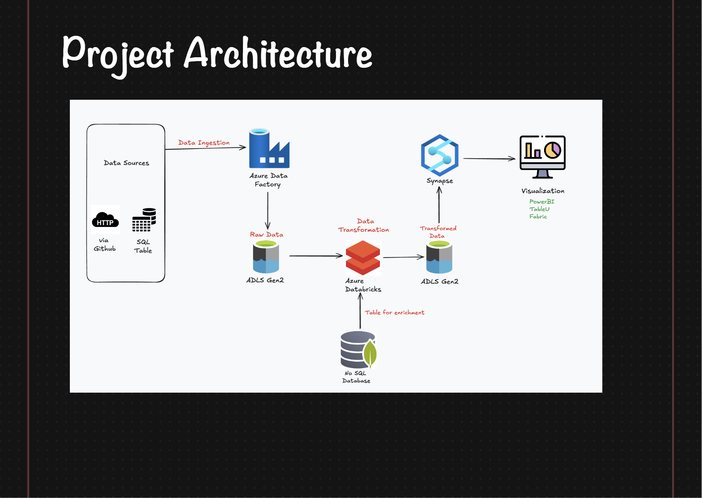
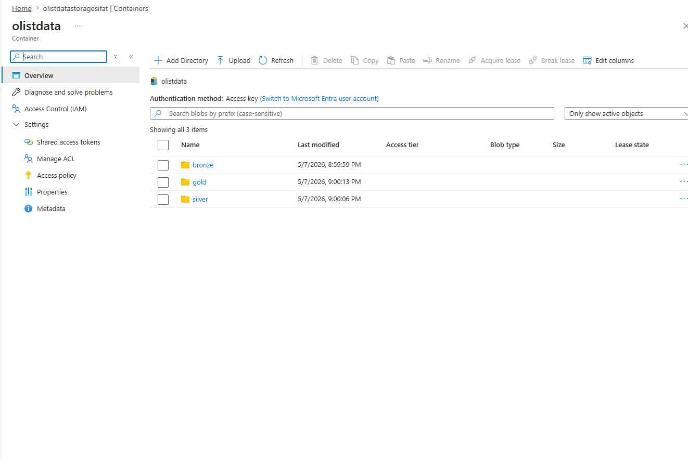
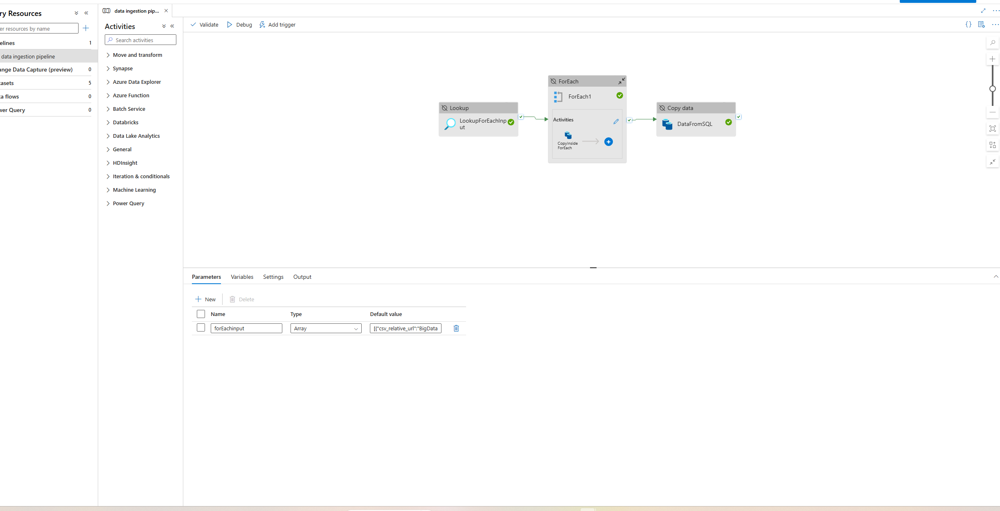
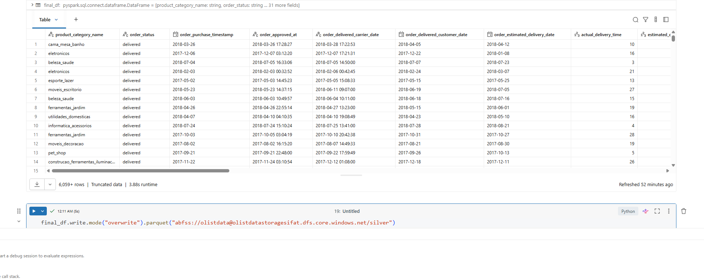

# Azure Big Data Engineering Project – Brazilian E-Commerce Dataset
## 📌 Project Overview
This project demonstrates an end-to-end Azure Data Engineering pipeline using the Brazilian E-Commerce (Olist) dataset.  
The pipeline was designed using Azure cloud services and implemented following the **Medallion Architecture** approach for scalable and organized data processing.
The project integrates:
- Azure Data Factory (ADF)
- Azure Data Lake Storage Gen2
- Azure Databricks
- SQL Server
- MongoDB
- Filess.io Cloud Database
---
# 🏗️ Architecture Overview
##**Prject Architecture**

## Medallion Architecture
The project follows a layered data engineering architecture:
### 🥉 Bronze Layer
- Raw data ingestion layer
- Data loaded directly from SQL Server and MongoDB
- Stored in Azure Data Lake Storage Gen2
### 🥈 Silver Layer
- Cleaned and transformed data
- Data preprocessing using Spark and Pandas
- Standardized schema and improved data quality
---
# ⚙️ Technologies Used
## Azure Services
- Azure Data Factory (ADF)
- Azure Data Lake Storage Gen2
- Azure Databricks
## Databases
- SQL Server
- MongoDB
- Filess.io
## Data Processing
- Apache Spark
- PySpark
- Pandas
---
# 📂 Dataset Source
Dataset used in this project:
- [Brazilian E-Commerce Public Dataset by Olist](https://www.kaggle.com/datasets/olistbr/brazilian-ecommerce)
---
# 🔄 Data Ingestion Pipeline
## Source Systems
The Olist dataset was first loaded into:
- SQL Server
- MongoDB
using **Filess.io** cloud database services.
---
## Azure Data Factory Pipeline
Azure Data Factory was used to:
- Connect source databases using **Linked Services**
- Dynamically process datasets using **Lookup Activity**
- Automate iterations using **ForEach Loop**
- Copy raw data into Azure Data Lake Storage
--
# 🚀 Azure Databricks Processing
Azure Databricks was used for:
- Reading parquet/raw datasets from ADLS
- Data cleaning
- Handling missing values
- Data preprocessing
- Feature engineering
- Writing transformed datasets into the Silver layer
### Technologies Used
- PySpark
- Pandas
---
## Example Spark Write Operation
```python
final_df.write.mode("overwrite").parquet(
    "abfss://olistdata@olistdatastoragesifat.dfs.core.windows.net/silver"
)
```
---
# 📸 Project Screenshots
## Azure Data Lake Storage Container

---
## Azure Data Factory Pipeline

---
## Azure Databricks Processing

---
# ✨ Key Features
- End-to-end Azure Data Engineering Pipeline
- Dynamic ingestion using Lookup and ForEach
- Cloud-based scalable architecture
- Medallion Architecture implementation
- Big data processing with Spark
- Data preprocessing using PySpark and Pandas
---
# 📚 References
## Dataset
- https://www.kaggle.com/datasets/olistbr/brazilian-ecommerce
## Filess.io
- https://filess.io
## Azure Databricks Storage Tutorial
- https://learn.microsoft.com/en-us/azure/databricks/connect/storage/tutorial-azure-storage
## Reference GitHub Project
- https://github.com/mayank953/BigDataProjects/blob/main/Project-Brazillian%20Ecommerce
---
# 🔮 Future Improvements
- Add Gold Layer for analytics-ready datasets
- Automate orchestration schedules
- Integrate Power BI dashboards
- Add real-time streaming support
- CI/CD deployment integration
---
# 👨‍💻 Author
## Fahim Hossain Sifat
Machine Learning Engineer | Data Engineer | AI Researcher
